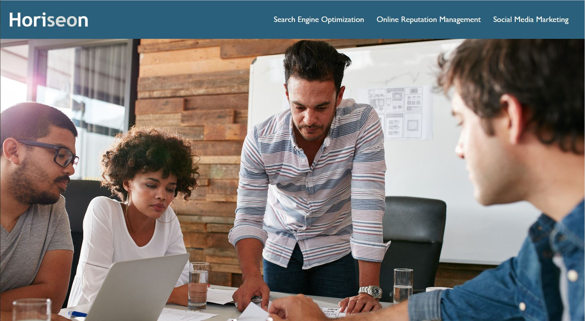
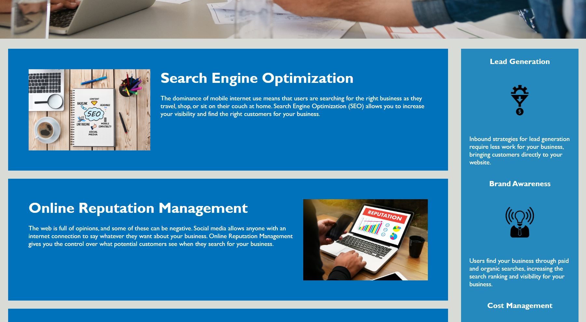
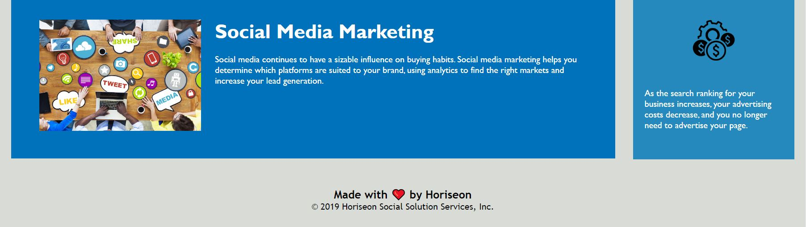

# Accessibility Refactoring
Making the Horiseon webpage accessible for everyone

## Table of Contents

- [Description](#description)
- [Deployed Application](#deployed-application)
- [Installation](#installation)
- [Usage](#usage)
- [Credits](#credits)
- [License](#license)

## Description

Given existing code to a website for an example business called Horiseon, I have made that code more accessible with a number of small changes. This helps Horiseon's client base become broader and potentially more diverse to those who require screen readers and other accessibility tools. In providing a more semantic and logical approach in structuring both the html and css files, as well as appending alt text to each image, Horiseon will now be able to cater to a larger audience. The added favicon is an extra touch that helps clients remember Horiseon and their services. If Horiseon needs to make a change after my edits have been implemented, they can easily found the correct section with the comments located throughout the html and css files.

## Deployed Application:

https://miss-mad.github.io/accessibility-refactoring/

## Installation

No installation needed.

## Usage

Below are screenshots of the Horiseon webpage. Visually, it will look very similar, but additional accessible measures have been integrated.

## Credits

Collaborators:

Mac Greene (fellow bootcamper; github page unknown)

List of resources used:

https://www.lcn.com/blog/beginners-guide-favicons/

https://coding-boot-camp.github.io/full-stack/github/professional-readme-guide

http://www.davidmacd.com/blog/alternate-text-for-css-background-images.html

https://www.aditus.io/aria/aria-label/

https://www.internetingishard.com/html-and-css/web-typography/#other-basic-typography-guidelines

## License

No licenses.

---